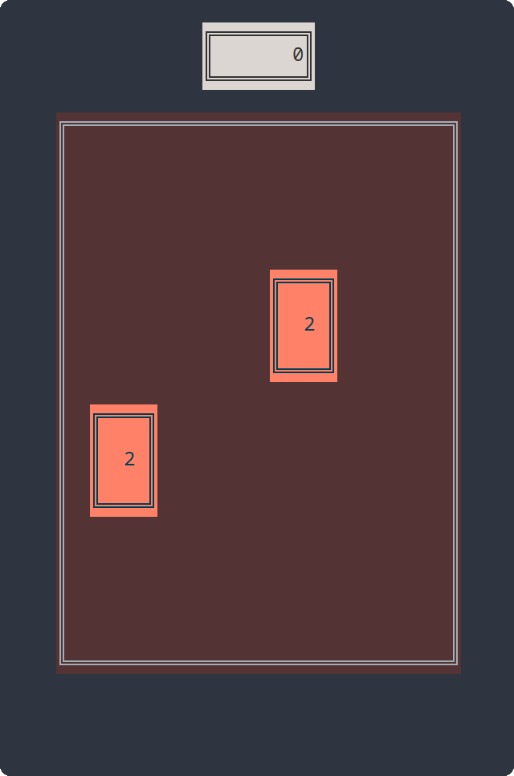

# tui48



`tui48` is a clone of the popular single-player sliding tile puzzle video game
orginally developed by Gabriele Cirulli. Instead of using a GUI, it is a TUI
application -- that is, a "Text User Interface" app meant to be run in
a [terminal emulator].

I originally developed it after becoming dissatisfied with the poor
responsiveness of a touchscreen implementation I was playing on a seatback
infotainment system during an international flight. I realized "hey, this is
simple enough that even I should be able to implement a clone!".


## Installing

The best way to install and run this is to first install rust [using rustup],
then:

```
git clone https://github.com/waynr/tui48
cd tui48
cargo install --path ./
```

## Running

Once installed, try running it in your favorite terminal emulator!. I recommend
[alacritty], which what I prefer for my every day terminal usage and is the
only terminal emulator I've tested it on.

If you do use a different terminal emulator, please let me know and report any
bugs on this git repo's issue tracker!

## Gameplay

The object of the game is to repeatedly combine like tiles to produce their sum
value. For example, if two `2` tiles are side-by-side and the player slides the
board left or right then those two tiles combine into a `4`. Likewise, `4` and
`4` produce `8`, `8` and `8` produce `16`, and so on.

Each time a pair of tiles is combined, the pre-combination face value of those
tiles is added to the score. For example, if `32` and `32` are combined the
score increases by `32` points.

The game ends when no moves are possible -- that is, when all tile positions on
the board are filled and slides are not possible in any direction because no
two tiles with like value are adjacent to one another.

The object of the game is to produce a tile with a value of `2048`, but `tui48`
will allow the player to continue as far as they can to produce higher values
-- `4096`, `8192`, etc.

### Controls

<dl>
  <dt>q</dt>
  <dd>Quit the current game and restore the terminal buffer to its pre-game state</dd>
  <dt>h / left arrow</dt>
  <dd>slide tiles left</dd>
  <dt>j / down arrow</dt>
  <dd>slide tiles down</dd>
  <dt>k / up arrow</dt>
  <dd>slide tiles up</dd>
  <dt>l / right arrow</dt>
  <dd>slide tiles right</dd>
</dl>

[terminal emulator]: https://en.wikipedia.org/wiki/Terminal_emulator
[using rustup]: https://rustup.rs/
[alacritty]: https://github.com/alacritty/alacritty

